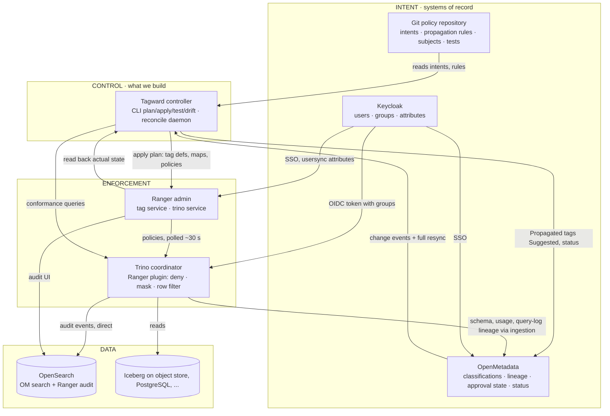
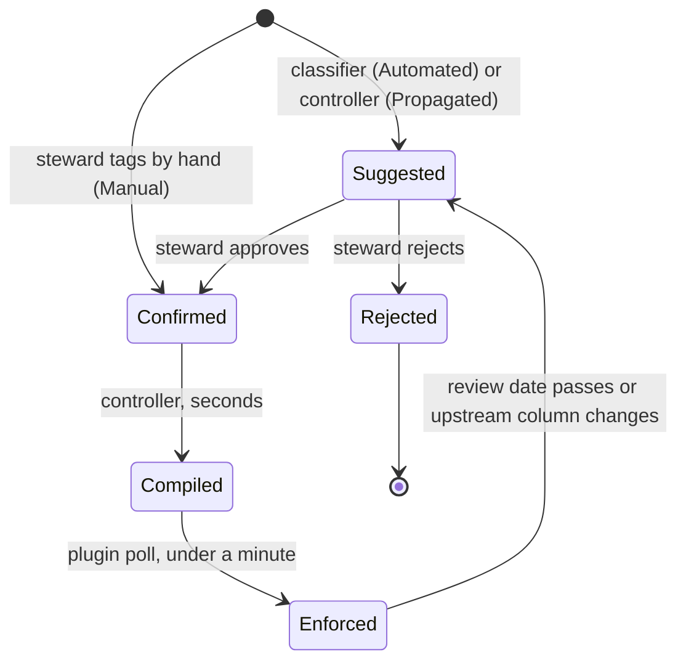

# 02 · Architecture

The visual version of this document is the published blueprint; this file is the
normative text.

## Four planes

## Components and responsibilities

| Component | Responsibility | System of record for |
| --- | --- | --- |
| Git policy repository | Policy intent, propagation rules, subject mappings, conformance tests | Intent |
| OpenMetadata | Asset inventory, lineage, classification, approval workflow, status display | Classification and approval |
| Keycloak | Authentication for every UI, group claim for Trino, attributes for row filters | Identity |
| Controller | Compile, apply, reconcile, propagate, verify, report | Nothing. It is stateless. |
| Ranger admin | Store compiled policies, serve them to plugins, audit UI | Compiled policy |
| Trino + Ranger plugin | Enforce at query time, write audit | Enforcement decision |
| OpenSearch | Search index for OpenMetadata, audit index for Ranger | Audit |
| PostgreSQL | Databases for OpenMetadata, Ranger, Keycloak | Their internal state |

## The seven flows

1. **Ingest.** OpenMetadata pulls schema, usage and query-log column lineage from
   Trino, and OpenLineage events from Spark or Flink. Assets exist before anyone
   classifies them.
2. **Classify.** OpenMetadata's classifier writes labels of type Automated in state
   Suggested. Stewards write labels of type Manual, which are Confirmed on creation.
3. **Propagate.** The controller walks column lineage from every Confirmed
   sensitive tag and writes labels of type Propagated in state Suggested, stopping
   at declassification tags and at the configured depth.
4. **Approve.** A steward confirms or rejects each Suggested label in OpenMetadata.
5. **Compile and apply.** Confirmed labels × intents produce a plan of Ranger
   objects. The applier writes only objects it owns and removes orphans.
6. **Enforce.** The Ranger plugin in Trino polls the admin, caches policies,
   rewrites or denies each query, and writes audit directly to OpenSearch.
7. **Verify and feed back.** Conformance tests run as synthetic users. Drift
   compares intent, Ranger and observed behavior. Status and sensitive-access
   counts are written onto each asset in OpenMetadata.

## Life of a tag

Label types and states are native to OpenMetadata's tag label model. We add no
custom entity for the workflow.

## Latency budget

| Hop | Mechanism | Typical | Bound |
| --- | --- | --- | --- |
| OpenMetadata change → controller | webhook | seconds | full resync interval, default 10 min |
| Controller plan + apply | REST to Ranger | seconds | depends on plan size |
| Ranger admin → Trino plugin | plugin poll | ≤ 30 s | `ranger.plugin.trino.policy.pollIntervalMs` |
| Total, tag confirmed → enforced | | under a minute | under 12 minutes worst case |

The total is published as a service level and shown on the asset in OpenMetadata
as "enforced since".

## What is deliberately not here

- No Apache Atlas. Its features are mapped to replacements in ADR-001.
- No Solr. Ranger audit goes to the OpenSearch cluster OpenMetadata already needs. ADR-004.
- No Gravitino in the first release. ADR-005.
- No second writer into Ranger. Hand-written Ranger policies are allowed, untouched, and flagged in drift reports.
