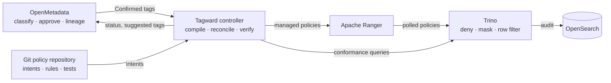

# A tag becomes a ward

**Tagward is an all open-source, fully packaged data governance stack.** A
classification confirmed in OpenMetadata becomes an enforced policy in Trino,
through Apache Ranger, with one controller in the middle, a test that proves it,
an audit row that records it, and no commercial license anywhere.

!!! info "Status: specification phase, first iteration under way"
    The architecture, decisions and specifications are written. The controller
    validates policy repositories today. The compose stack that proves the
    enforcement and audit path is the current milestone. See the [roadmap](roadmap.md).

## The problem

Every organisation that runs Trino on a lakehouse ends up with three systems: a
catalog where people describe data, a policy engine where administrators write
access rules, and the query engine where access actually happens. The three are
installed separately, speak different type systems, and are kept consistent by
hand. Tagging a column "PII" in the catalog changes nothing at query time, and
nobody can prove that the column is masked for the people who should not see it.

Commercial products sell exactly this loop. Until now there was no packaged
open-source equivalent. The classic open-source answer, Apache Atlas feeding Ranger
tag-sync, needs a heavy runtime, has no open Trino mapper, and stops at the
enforcement boundary with no feedback.

## How it works

1. **Classify.** Stewards and OpenMetadata's classifier tag columns. Automated tags are suggestions until a human confirms them.
2. **Declare intent.** A small YAML file in your own git repository says what a tag means: who is allowed, who sees masked values, who is denied, which rows each audience may see.
3. **Compile and apply.** The Tagward controller turns Confirmed tags and intents into Apache Ranger tag definitions, masking, access and row-filter policies. It owns what it writes, removes what is orphaned, and never touches a policy a human wrote.
4. **Enforce.** Trino's native Ranger plugin applies the policies at query time. A denied query fails, a masked column is hashed or redacted, a filtered table shows only the right rows.
5. **Prove and feed back.** Conformance tests run real queries as synthetic users and assert the outcome. The asset in OpenMetadata shows whether it is enforced, since when, and who has been reading it.

[Read the architecture](02-architecture.md){ .md-button .md-button--primary }
[Open the interactive blueprint](blueprint.html){ .md-button }

## What makes it different

- **Nothing is enforced before a human confirms it**

    A false positive from a classifier can never lock a dashboard out overnight.
    Only Confirmed tags reach the compiler.

- **Fail safe by default**

    A new column on a sensitive table is quarantined until classified. A lapsed
    review keeps enforcing until someone decides. An unknown group fails the plan.

- **One system of record per fact**

    Classification lives in OpenMetadata, intent in git, compiled policy in
    Ranger, identity in Keycloak. Nothing is synchronised both ways.

- **Portable governance**

    Your policies are plain YAML with a published schema. Replace our images and
    charts tomorrow and lose nothing.

- **Proof, not claims**

    Conformance tests and drift detection run in CI and in production. The status
    is written on the asset where stewards work.

- **No commercial license, anywhere**

    Trino, Ranger, OpenMetadata, Keycloak, OpenSearch, PostgreSQL. Apache 2.0
    and PostgreSQL licenses. A license gate runs in CI.

## What it is not

- Not a new catalog, a new policy engine or a new query engine. It connects the best open-source ones.
- Not a user interface. OpenMetadata is the front door, Ranger admin the operator console, the controller a command line and a daemon.
- Not enforcement outside Trino, yet. Other engines and direct object-store access are visible and flagged as side doors; catalog-level grants come later.

## The three repositories

| Repository | What it holds |
| --- | --- |
| [tagward/tagward](https://github.com/tagward/tagward) | This site, the decisions, the specifications, the version matrix, the Helm charts, the images we build, the laptop demo. The master repository. |
| [tagward/tagward-controller](https://github.com/tagward/tagward-controller) | The controller. Java. The only component with code of our own. |
| [tagward/tagward-policy-template](https://github.com/tagward/tagward-policy-template) | The repository your organisation forks to hold its governance as code. |

## Get involved

Read the [vision](01-vision-and-principles.md), then the
[roadmap](roadmap.md). Design changes start as an
[architecture decision record](adr/README.md). Contributions follow the
[contributing guide](https://github.com/tagward/tagward/blob/main/CONTRIBUTING.md)
and the [code of conduct](https://github.com/tagward/tagward/blob/main/CODE_OF_CONDUCT.md).
Security reports go through
[GitHub private reporting](https://github.com/tagward/tagward/security/advisories/new).

Apache, Apache Ranger and Trino are trademarks of their respective owners. Tagward
is an independent project, not affiliated with the Apache Software Foundation, the
Trino Software Foundation or Collate.
